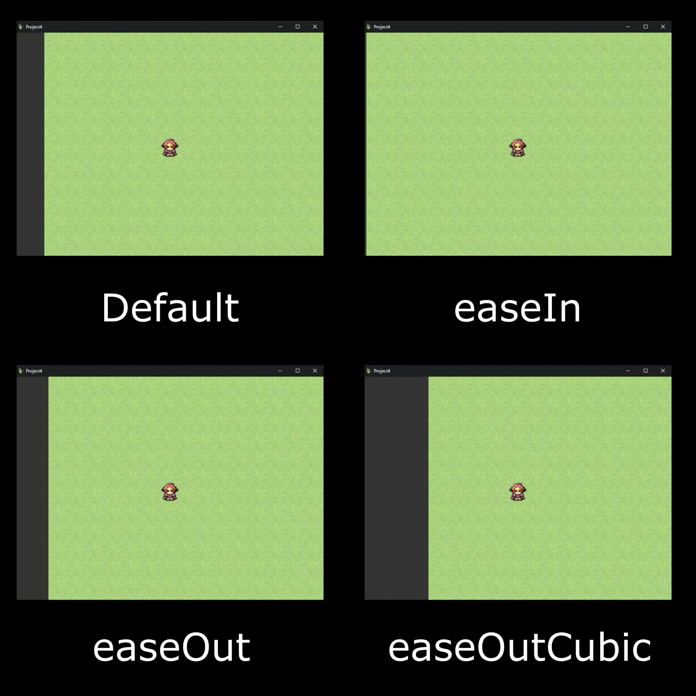

# SmoothTransition

**SmoothTransition** is a RPG Maker MV/MZ plugin for handling smooth transitions, aiming to improve user experience(?) and look & feel for players, and replace the boring default `linear` transition.



## Supported transition types

Currently, only 7 types of transitions are supported because I'm too lazy  💀

* `linear`

* `easeIn`

* `easeOut`

* `easeInOut`

* `easeInCubic`

* `easeOutCubic`

* `easeInOutCubic`

Of course I will add more soon, but you can add one yourself and create a Pull Request if you want ;)

## Downloading the latest version

You can download the latest version from [the Releases page](https://github.com/Serena1432/SmoothTransition/releases), or you can simply clone this repository. It's about the same thing.

## Installation

After downloading, you should put it into the `js/plugins` folder of your RPG Maker MV/MZ game. After that, go to the **Plugin Manager** section (or press <kbd>F10</kbd>) and add the **SmoothTransition** plugin into the list.

Change the Plugin Parameters as you want, save the project and then you can use the plugin!

## Usage

This plugin provides both **Script Commands** and **Plugin Commands**, and you can use either way that you want.

### Script Commands (API Documentation)

#### `SmoothTransition` class

This is a static class used to define global properties and functions used by Plugin or Script Commands.

##### Properties

###### `SmoothTransition.defaultTransitionType`

* **Type:** `string`

* **Assignable:** Yes

* **Default Value**: `"easeOut"`

The default transition type that will be used for all transitions (if no specific transition type is defined).

Assign a new value to this property to switch to another transition type.

###### `SmoothTransition.overwritePictureTransition`

* **Type:** `boolean`

* **Assignable**: Yes

* **Default Value**: `true`

Enable/disable overwriting the default picture transition in the game (replacing default `linear` transition with SmoothTransition in Move Picture command).

Assign a new value to this property to switch to enable/disable it.

###### `SmoothTransition.transitionTypes`

* **Type:** `object` of `function`

* **Assignable:** Yes

Contains a list of objects with functions for each `transitionType` to calculate the values.

This property is assignable with new `transitionType` like the code below:

```js
SmoothTransition.transitionTypes["easeOut"] = function(value) {
    return Math.sin((value * Math.PI) / 2);
}
```

Other functions will call the methods in `SmoothTransition.transitionTypes` with this argument below:

| **Argument** | **Type** | **Required** | **Description**                   |
| ------------ | -------- | ------------ | --------------------------------- |
| `value`      | `number` | Yes          | The input value to be calculated. |

Then that method have to return a value as described below:

| **Property** | **Type** | **Description**              |
| ------------ | -------- | ---------------------------- |
| `value`      | `number` | The calculated/output value. |

##### Methods

###### `SmoothTransition.getValue(value, reverse = false, transitionType)`

* **Type:** `function`

Calculate a value using the given transition type.

* **Passable Arguments:**

| **Argument**     | **Type**  | **Required** | **Description**                                                                                                                           |
| ---------------- | --------- | ------------ | ----------------------------------------------------------------------------------------------------------------------------------------- |
| `value`          | `number`  | Yes          | The input value to be calculated.<br/>Must be between `0` and `1`.                                                                        |
| `reverse`        | `boolean` | No           | Whether the result is reversed (from `1` to `0` instead of `0` to `1`).<br/>Default value is `false`.                                     |
| `transitionType` | `string`  | No           | The transition type will be used for transitioning.<br/>Default value is the previously defined `SmoothTransition.defaultTransitionType`. |

* **Returns**: `number`
  This function will return the output value calculated from the defined transition type.

* **Examples**:

```js
SmoothTransition.getValue(0.5, false, "easeOut");
// 0.7071067811865475
```

###### `SmoothTransition.processTransition(time, callback, transitionType)`

* **Type:** `function`

Process a transition using the duration, callback function and transition type given.

* **Passable Arguments**:

| **Argument**     | **Type**          | **Required** | **Description**                                                                                                                                                    |
| ---------------- | ----------------- | ------------ | ------------------------------------------------------------------------------------------------------------------------------------------------------------------ |
| `time`           | `number`          | Yes          | The transition duration defined for transitioning the value from `0` to `1` (in miliseconds).                                                                      |
| `callback`       | `function(value)` | Yes          | The callback function that will be called each time the output value changes.<br/>The only passed argument will be `value` (`number`) containing the output value. |
| `transitionType` | `string`          | No           | The transition type will be used for transitioning.<br/>Default value is the previously defined `SmoothTransition.defaultTransitionType`.                          |

* **Returns**: `number`
  This function will return a number containing the Interval ID that you can use with the `clearInterval` function to stop the transition midway.

* **Examples**:

```js
var intervalId = SmoothTransition.processTransition(1000, (value) => {
    var x = Math.floor(640 * value) + 320; // x will be transitioning from 320 to 640
    var y = Math.floor(240 * value) + 120; // y will be transitioning from 120 to 360
    $gameScreen.showPicture(1, "picture", 0, x, y, 100, 100, opacity, 0);
    // The picture will be transitioning from (320, 120) to (960, 360)
}, "easeOut");
// Returns a number containing the Interval ID
clearInterval(intervalId);
// Use the command above if you want to stop the transition midway
```

###### `SmoothTransition.parseVariable(input)`

* **Type:** `function`

Parse the given variable input into integer. Supports referencing a variable from current RPG Maker save file.

* **Passable Arguments:**

| **Argument** | **Type** | **Required** | **Description**                                                                                                                                                          |
| ------------ | -------- | ------------ | ------------------------------------------------------------------------------------------------------------------------------------------------------------------------ |
| `input`      | `string` | Yes          | The input value to be calculated.<br/>You can also pass `\V[n]` (as same as in RPG Maker MV's Show Text command) to reference a variable in current RPG Maker save file. |

* **Returns**: `?number`
  This function will return a number containing the parsed value from the input given.

* **Examples**:

```js
// Parsing a normal number
SmoothTransition.parseVariable("29");
// 29

// Referencing the value from a variable
SmoothTransition.parseVariable("\\V[11]");
// Will be the same as $gameVariables.value(11)
```

#### `Game_Transition` class

```js
new Game_Transition(id, variable, time, command, interpreter)
```

A general class containing the data for a SmoothTransition.

##### Properties

###### `_id`

* **Type:** `number`

* **Assignable:** Yes

The current transition ID.

###### `_variables`

* **Type:** `object`

* **Assignable**: Yes

The transition's variables data. It's an object containing these two child properties:

| **Property** | **Type** | **Description**                                                |
| ------------ | -------- | -------------------------------------------------------------- |
| `start`      | `number` | The value assigned to the variable when the transition starts. |
| `end`        | `number` | The value assigned to the variable when the transition ends.   |

###### `_time`

- **Type:** `?number`

- **Assignable**: Yes

The transition's given duration.

###### `_command`

- **Type:** `?string`

- **Assignable**: Yes

The Plugin Command that will be run each time the transition's current value changes. You can also use `|` (with spaces) to split multiple Plugin Commands.

###### `_interpreter`

- **Type:** `?Game_Interpreter`

- **Assignable**: Yes

The transition's assigned interpreter. Required to be able to call Plugin Commands.

###### `_interval`

- **Type:** `?number`

- **Assignable**: No

The transition's current Interval ID. Will be assigned automatically when the transition starts.

##### Methods

###### `value(name)`

- **Type:** `function`

- **Passable Arguments:**

| **Argument** | **Type** | **Required** | **Description**    |
| ------------ | -------- | ------------ | ------------------ |
| `name`       | `string` | Yes          | The variable name. |

- **Returns**: `number`
  Return the transition's variable value by name.

Can be overwritten by other plugins.

###### `setValue(name, value)`

- **Type:** `function`

- **Passable Arguments:**

| **Argument** | **Type** | **Required** | **Description**           |
| ------------ | -------- | ------------ | ------------------------- |
| `name`       | `string` | Yes          | The variable name.        |
| `value`      | `number` | Yes          | The variable's new value. |

Set a new value for a transition variable.

Can be overwritten by other plugins.

###### `time()`

* **Type:** `function`

* **Returns**: `?number`
  Return the transition's given duration.

Can be overwritten by other plugins.

###### `setTime(value)`

- **Type:** `function`

- **Passable Arguments:**

| **Argument** | **Type** | **Required** | **Description**              |
| ------------ | -------- | ------------ | ---------------------------- |
| `value`      | `number` | Yes          | The new transition duration. |

Set a new duration for the transition.

Can be overwritten by other plugins.

###### `command()`

- **Type:** `function`

- **Returns**: `?string`
  Return the transition's current Plugin Command.

Can be overwritten by other plugins.

###### `setCommand(command)`

- **Type:** `function`

- **Passable Arguments:**

| **Argument** | **Type** | **Required** | **Description**                      |
| ------------ | -------- | ------------ | ------------------------------------ |
| `command`    | `string` | Yes          | The transition's new Plugin Command. |

Set a new Plugin Command for the transition.

Can be overwritten by other plugins.

###### `interpreter()`

- **Type:** `function`

- **Returns**: `?Game_Interpreter`
  Return the transition's current interpreter.

Can be overwritten by other plugins.

###### `setInterpreter(interpreter)`

- **Type:** `function`

- **Passable Arguments:**

| **Argument**  | **Type**           | **Required** | **Description**                 |
| ------------- | ------------------ | ------------ | ------------------------------- |
| `interpreter` | `Game_Interpreter` | Yes          | The new transition interpreter. |

Set a new interpreter for the transition.

Can be overwritten by other plugins.

###### `start()`

* **Type:** `function`

Start the transition with the data given.

Requires `_variables`, `_time`, `_command` and `_interpreter` properties to be defined. If not, you can set those up using `setValue()`, `setTime()`, `setCommand()`, and `setInterpreter()`.

Can be overwritten by other plugins.

###### `stop()`

- **Type:** `function`

Stop the current transition. Do nothing if the transition hasn't started yet.

Can be overwritten by other plugins.

###### `clear()`

- **Type:** `function`

Clear all transition data.

#### `Game_Transitions` class

```js
new Game_Transitions()
```

A general class representing the transition container, containing data from all SmoothTransitions.

This will be assigned into `$gameVariables.transitions` when the first Plugin Command runs.

##### Properties

###### `_transitions`

* **Type:** `object`

An object containing all `Game_Transition` by transition IDs.

##### Methods

###### `transition(id)`

* **Type:** `function`

* **Passable Arguments**:

| **Argument** | **Type** | **Required** | **Description**    |
| ------------ | -------- | ------------ | ------------------ |
| `id`         | `number` | Yes          | The transition ID. |

* **Returns**: `?Game_Transition`
  Return the transition data if the transition ID is valid.

Can be overwritten by other plugins.

###### `setTransition(id, {variables, time, command, interpreter})`

- **Type:** `function`

- **Passable Arguments**:

| **Argument** | **Type** | **Required** | **Description**          |
| ------------ | -------- | ------------ | ------------------------ |
| `id`         | `number` | Yes          | The transition ID.       |
| `data`       | `object` | Yes          | The new transition data. |

* The `data` object argument will have these child properties:

| **Property**       | **Type**           | **Required** | **Description**                                                                                                   |
| ------------------ | ------------------ | ------------ | ----------------------------------------------------------------------------------------------------------------- |
| `data.variables`   | `object`           | Yes          | See `Game_Transition.prototype._variables`.                                                                       |
| `data.time`        | `number`           | Yes          | The new transition duration.                                                                                      |
| `data.command`     | `string`           | Yes          | The transition's new Plugin Command.<br/>You can also use ` \| ` (with spaces) to split multiple Plugin Commands. |
| `data.interpreter` | `Game_Interpreter` | Yes          | The transition's new interpreter.                                                                                 |

Set a new data for the transition by transition ID.

Can be overwritten by other plugins.

###### `clear()`

* **Type:** `function`

Clear all data from all transitions.

Can be overwritten by other plugins.

###### `createEmpty(id)`

- **Type:** `function`

- **Passable Arguments**:

| **Argument** | **Type** | **Required** | **Description**    |
| ------------ | -------- | ------------ | ------------------ |
| `id`         | `number` | Yes          | The transition ID. |

Create a new transition with no data.

Can be overwritten by other plugins.

### Plugin Commands

#### `SmoothTransition picture value`

| **Argument** | **Required** | **Description**                   |
| ------------ | ------------ | --------------------------------- |
| `value`      | Yes          | `on` to enable, `off` to disable. |

Enable/disable overwriting the default picture transition in the game.

#### `SmoothTransition variable id name start end`

| **Argument** | **Required** | **Description**                                                                                                                                                                       |
| ------------ | ------------ | ------------------------------------------------------------------------------------------------------------------------------------------------------------------------------------- |
| `id`         | Yes          | The transition ID. Numbers only.                                                                                                                                                      |
| `name`       | Yes          | The variable name. Spaces are not allowed.                                                                                                                                            |
| `start`      | Yes          | The value assigned when the transition starts.<br/>You can also pass `\V[n]` (as same as in RPG Maker MV's Show Text command) to reference a variable in current RPG Maker save file. |
| `end`        | Yes          | The value assigned when the transition ends.<br/>You can also pass `\V[n]` (as same as in RPG Maker MV's Show Text command) to reference a variable in current RPG Maker save file.   |

Set a variable to be used in the transition.

**Examples:**

```
SmoothTransition variable 1 x 100 500
SmoothTransition variable 1 y 200 400
```

#### `SmoothTransition time id value`

| **Argument** | **Required** | **Description**                                                                                         |
| ------------ | ------------ | ------------------------------------------------------------------------------------------------------- |
| `id`         | Yes          | The transition ID. Numbers only.                                                                        |
| `value`      | Yes          | The transition's new duration, calculated by frames (the same as RPG Maker's default time calculation). |

Set a new duration for the transition.

**Examples:**

```
SmoothTransition time 1 60
```

#### `SmoothTransition cmd id command`

| **Argument** | **Required** | **Description**                                                                                                                       |
| ------------ | ------------ | ------------------------------------------------------------------------------------------------------------------------------------- |
| `id`         | Yes          | The transition ID. Numbers only.                                                                                                      |
| `command`    | Yes          | The transition's new Plugin Command. Spaces are allowed.<br/>You can also use ` \| ` (with spaces) to split multiple Plugin Commands. |

Set a new Plugin Command to be executed when the transition value changes.

**Examples:**

```
SmoothTransition cmd 1 TalkLive2d Koharu x y
```

#### `SmoothTransition start id`

| **Argument** | **Required** | **Description**                  |
| ------------ | ------------ | -------------------------------- |
| `id`         | Yes          | The transition ID. Numbers only. |

Start a transition by the transition ID.

**Examples:**

```
SmoothTransition start 1
```

#### `SmoothTransition stop id`

| **Argument** | **Required** | **Description**                  |
| ------------ | ------------ | -------------------------------- |
| `id`         | Yes          | The transition ID. Numbers only. |

Stop a transition by the transition ID.

**Examples:**

```
SmoothTransition stop 1
```

#### `SmoothTransition clear id`

| **Argument** | **Required** | **Description**                                                                               |
| ------------ | ------------ | --------------------------------------------------------------------------------------------- |
| `id`         | Yes          | The transition ID. Numbers only.<br/>Type `all` as the ID to clear data from all transitions. |

Clear all data from one or all transitions.

**Examples:**

```
SmoothTransition clear 1
SmoothTransition clear all
```

## License

This plugin is released under the MIT License, which means you can freely do anything with it without any limitations, including modifying the code or using it for commercial purposes!

If you've modified something and are willing to contribute it to this repository, feel free to create any Pull Requests.

## Contact me

You can see my contact information at the last section of [my profile](https://github.com/Serena1432).
